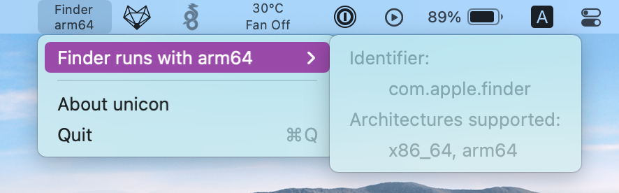
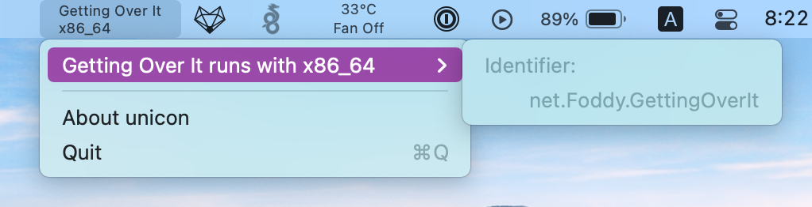

# unicon

実行中のアプリケーションがどのアーキテクチャ (命令セット) で動作しているのかをステータスメニューに表示するシンプルなアプリです。

どんなアプリがArmベースのMacにネイティブ対応しているか確認しやすくすることを目的としています。

## インストールするには

1. [GitHub Releases](https://github.com/otofune/unicon/releases) からアプリをダウンロードする
2. unicon.app を /Applications にコピーする
4. (Optional) 自動でアプリを起動するために、ログイン項目に追加する。詳しくは https://support.apple.com/guide/mac-help/mtusr003/mac を参照

もちろんビルドすることもできます。
unicon.xcworkspace を Xcode で開いてください。

現時点では外部のライブラリなどに依存していないため、開いたらすぐにビルドできます。

## 質問について

問題の報告や質問の [GitHub Issues への投稿](https://github.com/otofune/unicon/issues/new) はいつでも歓迎しています!

日本語または英語で書いてください。

### Q. なぜ "Architectures supported:" が表示されないことがあるのでしょうか?

実行中のアプリケーションの実行ファイルを開くための権限がないことがほとんどです。
サポートされるアーキテクチャのリストを取得するためには実行ファイルを開く必要があります。

`/Applications` は誰でも読み取り可能なので、ほとんどのアプリでは問題は起きません。  
ただユーザーデータとして実行ファイルが保存されていることもあります。
このアプリは App Sandbox を有効にしているため、ユーザーデータは「開く」ダイアログで選択しない限り開けず、"Architectures supported" を表示できないのです。

例えば Steam のゲームや .ipa ファイルからインストールした iOS アプリの実行ファイルはユーザーデータとして保存されています。

ライセンスについて
---

英語の [README](./README.md) を参照してください。
